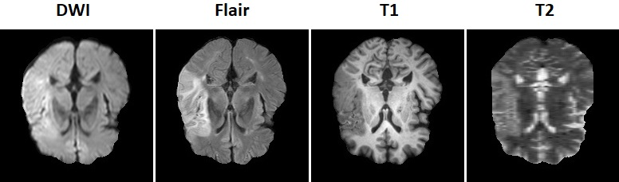

# ISLES (ISCHEMIC STROKE LESION SEGMENTATION)

### 1) Visual Result

 
  
 <em align="center">Fig 1: Segmentation on SISS dataset.</em>

### 2) About
**The purpose of this project is to build a CNN model for stroke lesion segmentaion using ISLES 2015 dataset.**

Recent studies have shown the potential of using magnetic resonance imaging (MRI) in diagnosing ischemic stroke. Reviewing hundreds of slices produced by MRI, however, takes a lot of time and can lead to numerous human errors. It is widely accepted by the medical practitioners that automated segmentation methods for ischemic stroke lesions could significantly speed up the beginning of a patient’s treatment. The automated segmentation can locate the tissue with lesions and give an estimate of its volume, which helps in the clinical practice by providing a better assessement and evaluation of the risks of each treatment. These reasons highlight the need for a fully automatic ischemic stroke lesion segmentation approach using a flexible, fast and effective deep neural network.

### 3) My CNN Architecture

### 4) Dataset
**SISS Dataset**

*File:&nbsp;&nbsp;&nbsp;&nbsp;&nbsp;&nbsp;&nbsp;&nbsp;&nbsp;&nbsp;&nbsp;&nbsp;&nbsp;&nbsp;&nbsp;&nbsp;&nbsp;&nbsp;&nbsp;
&nbsp;&nbsp;&nbsp;There are 4 types of MRI scan for one person*

*File Format:&nbsp;&nbsp;&nbsp;&nbsp;&nbsp;&nbsp;&nbsp;&nbsp;&nbsp;
.nii*

*Image Shape:&nbsp;&nbsp;&nbsp;&nbsp;&nbsp;&nbsp;
240(Slide Width) × 240(Slide Height) × 155(Number of Slide) × 4(Multi-mode)*

*Image Mode:&nbsp;&nbsp;&nbsp;&nbsp;&nbsp;&nbsp;&nbsp;
4 (Multi-mode)*

 

  

