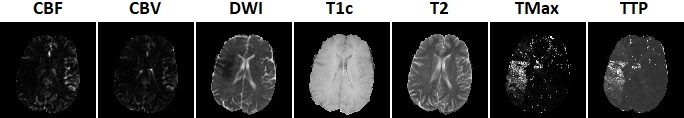
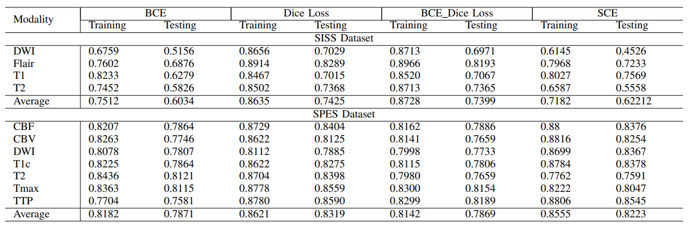
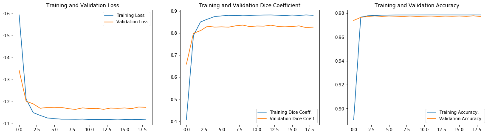
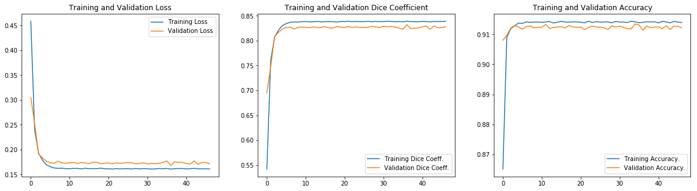

# ISLES (ISCHEMIC STROKE LESION SEGMENTATION)

### Visual Result

 
  
 <em align="center">Fig 1: Segmentation on SISS dataset.</em>

### 1) About
**The purpose of this project is to build a CNN model for stroke lesion segmentaion using ISLES 2015 dataset.**

Recent studies have shown the potential of using magnetic resonance imaging (MRI) in diagnosing ischemic stroke. Reviewing hundreds of slices produced by MRI, however, takes a lot of time and can lead to numerous human errors. It is widely accepted by the medical practitioners that automated segmentation methods for ischemic stroke lesions could significantly speed up the beginning of a patient’s treatment. The automated segmentation can locate the tissue with lesions and give an estimate of its volume, which helps in the clinical practice by providing a better assessement and evaluation of the risks of each treatment. These reasons highlight the need for a fully automatic ischemic stroke lesion segmentation approach using a flexible, fast and effective deep neural network.

### 2) Dataset
### 2.1) SISS Dataset

*File:&nbsp;&nbsp;&nbsp;&nbsp;&nbsp;&nbsp;&nbsp;&nbsp;&nbsp;&nbsp;&nbsp;&nbsp;&nbsp;&nbsp;&nbsp;&nbsp;&nbsp;&nbsp;&nbsp;
&nbsp;&nbsp;&nbsp;There are 4 types of MRI scan for one person*

*File Format:&nbsp;&nbsp;&nbsp;&nbsp;&nbsp;&nbsp;&nbsp;&nbsp;&nbsp;
.nii*

*Image Shape:&nbsp;&nbsp;&nbsp;&nbsp;&nbsp;&nbsp;
240(Slide Width) × 240(Slide Height) × 155(Number of Slide) × 4(Multi-mode)*

*Image Mode:&nbsp;&nbsp;&nbsp;&nbsp;&nbsp;&nbsp;&nbsp;
4 (Multi-mode)*

 

  
  
 <em align="center">Fig 2:SISS dataset.</em>

### 2.2) SPES Dataset

*File:&nbsp;&nbsp;&nbsp;&nbsp;&nbsp;&nbsp;&nbsp;&nbsp;&nbsp;&nbsp;&nbsp;&nbsp;&nbsp;&nbsp;&nbsp;&nbsp;&nbsp;&nbsp;&nbsp;
&nbsp;&nbsp;&nbsp;There are 7 types of MRI scan for one person*

*File Format:&nbsp;&nbsp;&nbsp;&nbsp;&nbsp;&nbsp;&nbsp;&nbsp;&nbsp;
.nii*

*Image Shape:&nbsp;&nbsp;&nbsp;&nbsp;&nbsp;&nbsp;
96(Slide Width) × 110(Slide Height) × 71(Number of Slide) × 7(Multi-mode)*

*Image Mode:&nbsp;&nbsp;&nbsp;&nbsp;&nbsp;&nbsp;&nbsp;
7 (Multi-mode)*

 

  
  
 <em align="center">Fig 3: SPES dataset.</em>

### 2.3) Data Augmentation
|    Methods    |     Range     |
| ------------- | ------------- |
|   rescale     |   1.0/255     |
|rotation_range |    30         |
|horizontal_flip|    True       |
|vertical_flip  |    True       |
|shear_range    |    0.2        |
|zoom_range     |    0.1        |

### 3) My CNN Architecture
### 4) Evaluation Metric
True Positive (TP): TP implies number of true positives, that is, positive correctly identified as positive.
 
True Negative (TN): TN implies number of true negatives, that is, negative correctly identified as negative.
 
False Positive (FP): FP implies number of false positives, that is, negative incorrectly identified as positive.
 
False Negative (FN): FN implies number of false negatives, that is, positive incorrectly identified as negative.
#### 1. Dice Similiarty Coefficient:

 
#### 2. Sensitivity

 
#### 3. Specificity

### 5) Ortimizer and Hyperparameter
### 5.1) Optimizer 
[Adam Optimizer](https://arxiv.org/pdf/1412.6980.pdf)
### 5.2) Hyperparameter

 
Lri = Initial Learning Rate = 0.0001
 
decay factor(f) = 0.2
 
step = 2

### 5) Results

 
  
 <em align="center">Fig 6:Performance of proposed network in term of dice coefficient on each modality on SISS and SPES Dataset for
various loss functions.</em>
  
 
  
 <em align="center">Fig 7:From left to right: Plot for loss DSC and accuracy for training and validation set on SISS dataset.
</em>
 
  
 <em align="center">Fig 8:From left to right: Plot for loss DSC and accuracy for training and validation set on SPES dataset.</em>

